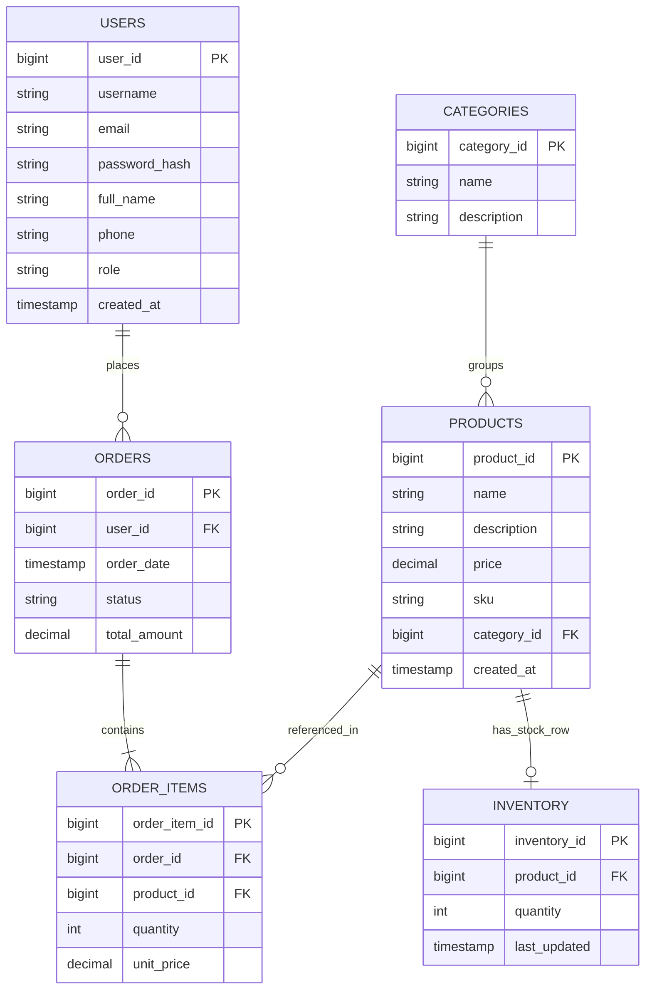

# Smart E-Commerce System

A Spring Boot 4 backend for an e-commerce catalogue, exposing the same business logic
over **REST** and **GraphQL**, backed by **PostgreSQL** for transactional data and
**MongoDB** for reviews and access logs.

Phase 1 was a JavaFX desktop application over raw JDBC. Phase 2 replaced it entirely —
the DAOs, the manual connection handling and the UI layer are gone, and the business
rules now live behind Spring Data repositories, a service layer and two API surfaces.

---

## Quick start

You need Java 21, PostgreSQL and MongoDB running locally.

```bash
createdb -U postgres smart_ecommerce_db
```

```bash
./mvnw spring-boot:run
```

That is the whole setup. The app creates its schema (`ddl-auto=update` in `dev`) and
seeds sample data on first start: 4 users, 5 categories, 12 products with stock,
2 orders and 4 reviews.

### Signing in

The seeder guarantees one administrator account exists and **prints its
credentials once, in the startup log**:

```
==========================================================
 Bootstrap administrator account created
   email    : admin@smartecommerce.rw
   password : <generated for this run>
 Change this before exposing the service to anyone else.
 Disable with app.seed.enabled=false
==========================================================
```

No password is published in this repository, and that is deliberate. A default
written into the README is a password every deployment shares, guessable exactly
because it is documented — and convenient enough that nobody changes it. So:

- **Leave `app.seed.admin-password` unset** and a fresh one is generated from
  `SecureRandom` for that run and printed as above.
- **Set it** and that value is used and *never* logged, on the assumption that a
  password you chose may be one you use elsewhere.

The same applies to `app.seed.sample-password` for the demo customer accounts
(`k.mugisha@example.com`, `j.doe@example.com`, `a.ingabire@example.com`).

Authentication is **HTTP Basic**. The username field accepts **either the e-mail
address or the username** — `admin@smartecommerce.rw` and `admin` both work, since
both columns are unique.

```bash
curl -u 'admin@smartecommerce.rw:<the password from your log>' http://localhost:8080/api/v1/users
```

The bootstrap check never modifies an account that already exists, so a password
you have changed yourself is safe. Turn seeding off entirely with
`app.seed.enabled=false`.

**In Swagger UI**, click the **Authorize** button at the top of the page and enter the
same e-mail and password. Do not use the browser's own popup — the API deliberately does
not send a `WWW-Authenticate` challenge, precisely so that popup never appears.

### Where things are

| | |
|---|---|
| Swagger UI | http://localhost:8080/swagger-ui.html |
| OpenAPI document | http://localhost:8080/v3/api-docs |
| GraphiQL | http://localhost:8080/graphiql |
| GraphQL endpoint | http://localhost:8080/graphql |
| Health | http://localhost:8080/actuator/health |

### Upgrading an existing database

Run once each, **before** starting the app:

```bash
psql -U postgres -d smart_ecommerce_db -f docs/sql/migration-phase2.sql
```

```bash
psql -U postgres -d smart_ecommerce_db -f docs/sql/migration-password-encoding.sql
```

```bash
psql -U postgres -d smart_ecommerce_db -f docs/sql/migration-phase3.sql
```

The first adds `users.role` and moves `OrderItems` to `order_items`; `ddl-auto` can do
neither. The second tags existing SHA-256 hashes `{sha256}` so those accounts keep
working — each one silently re-hashes to BCrypt on its owner's next successful login.

The third adds the `checkout_shortfalls` audit table and the indexes the Phase 3
reporting queries need. `ddl-auto=update` will create the table for you in dev but will
not create a single index, and `prod` runs `validate` — so this file is the authority for
both. It also applies two recommendations the Phase 1 index study left open with
measurements attached: the composite `(category_id, LOWER(name))` and the `pg_trgm` GIN
index for the catalogue's substring search.

---

## Project structure

```
src/main/java/rw/smart/ecommerce/
├── EcommerceApplication.java
├── config/                    -- application wiring
│   ├── CacheConfig            -- Caffeine caches, sized per staleness tolerance
│   ├── AsyncConfig            -- bounded executor for access logging
│   ├── MongoConfig            -- hand-wired mongodb-driver-sync client
│   ├── MongoSettings          -- app.mongo.* binding
│   ├── OpenApiConfig          -- document metadata + basicAuth scheme
│   └── DataSeeder             -- sample data + bootstrap admin (non-prod only)
├── security/                  -- one concern, one package
│   ├── SecurityConfig         -- filter chain, @EnableMethodSecurity, PasswordEncoder
│   ├── AppUserDetailsService  -- users table -> Spring Security, + hash upgrade
│   ├── LegacySha256PasswordEncoder
│   ├── RestAuthenticationEntryPoint   -- 401 as JSON, no browser popup
│   └── RestAccessDeniedHandler        -- 403 as JSON
├── core/<feature>/            -- user, category, product, inventory, order,
│                                 review, log, audit, report
│   ├── model/                 -- JPA entities (or Mongo documents for review/log)
│   ├── enums/                 -- plain constant lists
│   ├── dao/                   -- Spring Data repositories (+ Mongo repositories)
│   │   └── projection/        -- closed interface projections for the aggregates
│   ├── dto/                   -- validated requests, response projections
│   ├── service/ + service/impl
│   └── controller/            -- one REST controller + one GraphQL controller
└── utils/                     -- genuinely shared helpers
    ├── response/              -- StandardResponse, PageResponse
    ├── exceptions/            -- domain exceptions + handler/
    ├── pagination/            -- PaginationSupport (sort whitelist)
    ├── aspect/                -- ExecutionTimeAspect
    └── BsonValues
```

Each feature owns its whole vertical slice. There is **one controller per feature**, not
one for admins and one for customers — the resource is the same either way, and only the
permission differs.

---

## API design

### Personas are separated by role, not by URL

```java
@GetMapping                                  // public
public ... browse(...) { }

@Operation(summary = "Create a product (Admin only)")
@PreAuthorize("hasRole('ADMIN')")            // admin
@PostMapping
public ... create(@Valid @RequestBody ProductRequest request) { }
```

Catalogue reads are public. Everything else requires authentication, and management
operations require `ADMIN`. Unauthenticated requests get **401**, authenticated ones
without the role get **403** — both in the standard envelope.

### Every REST response uses one envelope

```json
{ "status": 200, "message": "12 product(s) found", "data": { } }
```

Errors use the same shape, so a client parses one structure and branches on `status`.
Validation failures put the field errors in `data`:

```json
{
  "status": 400,
  "message": "Validation failed for 2 field(s)",
  "data": { "price": "Price cannot be negative", "name": "Product name is required" }
}
```

### Catalogue query

```
GET /api/v1/products?keyword=mouse&categoryId=3&minPrice=10&maxPrice=80
                    &sortBy=price&direction=DESC&page=0&size=20
```

All parameters optional. `sortBy` is checked against a whitelist, so a bad value returns
400 instead of leaking a Spring Data `PropertyReferenceException` as a 500.

### Endpoints added in Phase 3

| | |
|---|---|
| `GET /api/v1/products/low-stock` | reorder report, lowest stock first (admin) |
| `GET /api/v1/products/{id}/related` | "customers also bought", from order history (public) |
| `GET /api/v1/categories/search` | paginated, keyword-filtered category listing (admin) |
| `GET /api/v1/orders/history` | paginated order history, optionally by status |
| `GET /api/v1/reports/sales/daily` | order count, revenue and average order value per day |
| `GET /api/v1/reports/sales/revenue` | total revenue over a window |
| `GET /api/v1/reports/orders/by-status` | counts and value grouped by status |
| `GET /api/v1/reports/products/top-selling` | ranked by units sold |
| `GET /api/v1/reports/products/missed-demand` | checkouts refused for want of stock |
| `GET /api/v1/reports/categories/revenue` | revenue per category |
| `GET /api/v1/reports/categories/summary` | product count and price range per category |
| `GET /api/v1/reports/categories/{id}/stock-distribution` | how a category's stock is spread |
| `GET /api/v1/reports/customers/top` | highest-spending customers |
| `GET /api/v1/reports/customers/lapsed` | bought before, not since a date |

The same ground is covered by GraphQL — `orderHistory`, `orders`, `searchUsers`,
`searchCategories`, `salesReport`, `catalogueReport`, and `relatedProducts` as a field
on `Product`. See [Reporting is where GraphQL earns its place](#reporting-is-where-graphql-earns-its-place)
for why the report queries are not merely a mirror of these.

Everything under `/reports` is `ADMIN`, declared once on the controller class rather than
per method — every one of them aggregates across all customers, and repeating the
annotation is what eventually leaves one of them public.

Report windows are optional and half-open: `from` inclusive, `to` inclusive at day
granularity because the service adds a day before querying. Writing the predicate as
`BETWEEN from AND to` instead would silently drop everything that happened on the last
day after midnight, which is most of it.

Ranked reports do **not** accept a sort parameter. The ordering is what makes the page
mean something; re-sorting it would not reorder the rows on the page, it would change
which rows are on the page.

### SKUs are generated, never supplied

Format `CAT-YYMM-NNNNN` — `PER-2608-00042` is Peripherals, August 2026, product 42.

The tail is the primary key, so the SKU is unique by construction: no uniqueness query,
no counter table, no retry on collision. It is assigned once and never regenerated —
moving a product to another category keeps the original prefix, because the SKU is on
labels and on historical order lines.

---

## GraphQL

Same services, same repositories, different transport:

```
GraphQL -> @Controller + @QueryMapping/@MutationMapping -> @Service -> @Repository -> DB
```

The repositories carry plain `@Repository`. `@GraphQlRepository` — which auto-exposes a
repository as a data fetcher — is deliberately **not** used, because it would let GraphQL
reach the database without passing through the service layer, skipping `@Transactional`,
`@PreAuthorize`, caching, the monitoring aspect and DTO mapping. Two transports, one set
of rules.

### Batched field resolution (DataLoader)

`Product.reviewSummary` is resolved by `@BatchMapping`, Spring for GraphQL's DataLoader
wrapper:

```graphql
{
  products(filter: { size: 20 }) {
    content { id name reviewSummary { averageRating reviewCount } }
  }
}
```

Resolved per product, that is 20 MongoDB aggregations for one screen. Batched, it is
**one** `$match: { productId: { $in: [...] } }`. Measured: 12 products → 1 aggregation,
and **0** when the field is not selected, since GraphQL only resolves what was asked for.

`category` and `stockQuantity` are *not* batch-resolved, and do not need to be — the
service already fetch-joins the category and loads stock for a whole page in one query,
so a DataLoader there would add machinery for no gain.

### Reporting is where GraphQL earns its place

Phase 3 gave the two transports the same coverage, but the reporting endpoints are not
just a mirror of the REST ones.

`salesReport` and `catalogueReport` are types whose **every field is a resolver**:

```graphql
query {
  salesReport(from: "2026-07-01", to: "2026-07-31") {
    totalRevenue
    daily { day revenue }
    byStatus { status orderCount }
    topProducts(limit: 5) { productName unitsSold }
  }
}
```

That is four dashboard panels in one request. Over REST it is four calls, each paying
authentication again — which [§6.5](docs/performance-report.md) measured at ~95 ms
apiece.

The second half matters more. A dashboard that renders only the revenue headline asks
only for `totalRevenue`, and the `date_trunc` group-by behind `daily` **never runs**.
REST cannot offer that: `/reports/sales/daily` computes the series whether the caller
draws it or not. A test asserts it with Hibernate's statement counter rather than by eye.

`relatedProducts` is a field on `Product` for the same reason `reviewSummary` is — it
belongs to a product, and costs nothing when unselected. Unlike `reviewSummary` it is
**not** batched: a catalogue page selecting it for twenty products would run twenty
self-joins, so it is meant for a detail view. Batching it would mean rewriting the
bought-together query to group over a set of anchor products, which is worth doing once
something actually asks for it that way.

Dates are ISO-8601 strings, not a custom scalar. Timestamps have been plain strings since
Phase 2, and adding a scalar now would change the wire format of every existing field for
the sake of four arguments. The cost is that a malformed date arrives as a valid `String`,
so `GraphQlDates` rejects it as a `BAD_REQUEST` naming the argument.

### Authorization lives on the methods

`/graphql` is a single POST endpoint, so URL rules cannot distinguish a public catalogue
query from a private one. Every non-public query and mutation carries its own
`@PreAuthorize`. There is no path rule underneath acting as a safety net, which *is* true
for REST — a difference that already caused one real defect (see the performance report,
§6.6).

The report field resolvers are the one place `@PreAuthorize` is deliberately **absent**,
and the reasoning is worth stating because it looks like the same omission. A
`@SchemaMapping` is only ever invoked with a source object of its parent type; nothing but
the `ADMIN`-gated root query returns a `SalesReport` or a `CatalogueReport`; so there is no
path to those fields that has not already been refused.

Phase 3 also fixed a second defect of the §6.6 family, found while testing the above.
Method security throws `AccessDeniedException` when a signed-in caller lacks the role, but
`AuthenticationCredentialsNotFoundException` when there is **no principal at all**.
`GraphQlExceptionResolver` classified only the first, so an unauthenticated call to any
admin query or mutation came back as `INTERNAL_ERROR` — "you need to sign in" reaching the
client as "we crashed", indistinguishable from a genuine fault and impossible to act on.
It now answers `UNAUTHORIZED`, matching what `GlobalExceptionHandler` had always done on
the REST side. Both paths have a test.

---

## Security

| | |
|---|---|
| Authentication | HTTP Basic over the `users` table, by e-mail |
| Authorization | `@PreAuthorize` with `@EnableMethodSecurity` |
| Password hashing | BCrypt via `DelegatingPasswordEncoder` |
| Legacy hashes | `{sha256}` read-only, auto-upgraded to `{bcrypt}` on next login |
| Sessions | none — stateless |

Stored hashes carry their algorithm as a `{prefix}`, which is what makes the next
algorithm change a one-line edit instead of a migration.

**Known cost:** because the API is stateless, credentials are verified on *every*
request, and BCrypt is deliberately slow. That is ~95 ms per authenticated call. See the
performance report §6.5 — it is the largest single optimization still available.

---

## Data model

PostgreSQL owns anything that must be transactional; MongoDB owns anything whose shape
varies or that is written far more often than it is read.



**MongoDB collections** (no foreign keys — the link is by value):

- `reviews` — rating, comment, tags, photos, helpful votes. Variable shape: some reviews
  have photos, most do not. Relationally that is a wide table of nullable columns.
- `access_logs` — one document per service-method invocation, written by the monitoring
  aspect. Append-only, never joined, read by time range.

Why the split matters in practice: placing an order writes an order, N items and N stock
decrements, and either all of it happens or none does. That is what `@Transactional` and
foreign keys give you, and it is not something to hand-roll.

`Inventory` is 1:1 with `Product` rather than a column on it, because stock changes far
more often than product metadata.

---

## How correctness is enforced

**Order placement** is the one operation that genuinely needs ACID. Stock is reserved
with a conditional update:

```sql
UPDATE inventory SET quantity = quantity - :amount
WHERE product_id = :productId AND quantity >= :amount
```

Zero rows updated means insufficient stock — check and decrement in one statement, with
no read-then-write race. If any line fails, the whole order rolls back: no partial order,
no stock reserved against an order that was never created.

The transaction attributes are declared rather than inherited:

```java
@Transactional(propagation = Propagation.REQUIRED,
        isolation = Isolation.READ_COMMITTED,
        timeout = 15,
        rollbackFor = Exception.class)
```

`READ_COMMITTED` is PostgreSQL's default and is stated so the assumption is visible
rather than inherited from a server setting somebody could change. Nothing here needs
more: the conditional update already makes check-and-take atomic, so there is no
read-then-write window for a stronger level to protect. `REPEATABLE_READ` would not make
this safer — it would make two customers buying the same product abort each other with
serialization failures instead of queueing. The timeout exists because a stalled checkout
holds inventory row locks that every other buyer of that product is waiting behind.

**Repeated basket lines are merged.** Left unmerged, two decrements of 3 against 5 units
take 3 and then fail — rolling back a checkout that a single line of 6 would also have
failed, but reporting the wrong requested quantity, and only after moving stock.

**A failed checkout still leaves a record.** `CheckoutAuditServiceImpl` writes the
shortfall on a `REQUIRES_NEW` transaction, one statement before the checkout rolls back.
Under the default `REQUIRED` the insert would join that transaction and be rolled back
with it — the record of the failure destroyed by the failure it records. That table is
what `/api/v1/reports/products/missed-demand` reads: sales the catalogue could not make,
which are invisible in the orders table because the order was never written.

It carries no foreign keys to `users` or `products`, deliberately. An audit row states
what was true at a moment in time; it must not block a product from being deleted later,
and it must not vanish when one is.

**Order status** follows an explicit state machine — `PENDING → PAID → SHIPPED →
DELIVERED`, with `CANCELLED` reachable from `PENDING` or `PAID`, and `DELIVERED` /
`CANCELLED` final. Cancelling returns the reserved stock.

**Deletes are guarded**: a product that appears in an order and a category still holding
products both return 409 rather than surfacing a foreign-key violation.

All of the above is asserted by `OrderTransactionRollbackTest` against a real database —
see [Build and test](#build-and-test).

---

## Performance

| Optimization | Where | Effect |
|---|---|---|
| Batch fetching | `default_batch_fetch_size=25` | paginated order list: **52 JDBC statements → 5** |
| Aggregates in SQL | `OrderRepository.summarizeByStatus` and friends | status breakdown reads **5 rows instead of 400** |
| `existsByUserId` | `UserServiceImpl.delete` | answered by an index instead of loading 400 orders, 1 200 lines and their products |
| Caffeine caches | `CacheConfig` | product detail 10.5 ms → 0.14 ms; daily sales report 11.7 ms → 0.17 ms |
| `@CachePut` on update | `ProductServiceImpl`, `UserServiceImpl` | the entry is replaced with the new value, not dropped |
| Interface projections | reports, reorder page | selects the columns the report renders, not whole entities |
| Batched stock lookup | `ProductServiceImpl.browse` | one query per page, not per row |
| Fetch-joined category | `ProductSpecifications` | no lazy load per row |
| `@BatchMapping` | `Product.reviewSummary` | 12 aggregations → 1 |
| Async access logging | `AccessLogServiceImpl` | MongoDB write off the request thread |
| Connection pooling | HikariCP | removed the ~96 ms per-call connect cost measured in Phase 1 |
| Response compression | `server.compression` | JSON catalogue pages |

Catalogue caches are correct **by eviction** — every path that moves stock evicts the
product cache, since a cached product carries a stock figure. Sales reports are correct
**by expiry**, deliberately: every checkout changes a revenue figure, so an eviction rule
would keep that cache permanently cold. A revenue figure is a snapshot with a
five-minute staleness bound, and it says so.

`@CachePut` is only safe because the cache manager is wrapped in a
`TransactionAwareCacheManagerProxy`, which defers every put and evict until the
transaction commits. Without it the cache is written before commit, and a constraint
violation at flush would leave a value cached that the database rejected.

Full measurements — including the negative results and one measurement that had to be
discarded for being invalid — are in
[docs/performance-report.md](docs/performance-report.md), section 11.

---

## Configuration

Four `.properties` files, no YAML:

| Profile | Schema | Notes |
|---|---|---|
| `application.properties` | — | shared settings, `dev` active by default |
| `dev` | `update` | local credentials, SQL logging, all actuator endpoints |
| `test` | `create-drop` | separate database, **seeding disabled** so tests own their fixtures |
| `prod` | `validate` | every secret from `${ENV}`, Swagger UI off, schema changes ship as reviewed migrations |

`spring.jpa.open-in-view=false` throughout, so lazy loading cannot leak into
serialization — services map to DTOs inside the transaction.

There is no embedded database on the classpath, so the `test` profile points at a real
PostgreSQL database:

```bash
createdb -U postgres smart_ecommerce_test_db
```

### Phase 3 profiling settings

The four files are **git-ignored** — they carry database credentials — so the settings
added in Phase 3 are recorded here as the reviewable copy. Apply them to your local
files.

`application.properties` (shared, all profiles):

```properties
spring.jpa.properties.hibernate.generate_statistics=false
spring.jpa.properties.hibernate.session.events.log.LOG_QUERIES_SLOWER_THAN_MS=0
spring.jpa.properties.hibernate.default_batch_fetch_size=25
spring.jpa.properties.hibernate.query.fail_on_pagination_over_collection_fetch=true
spring.jpa.properties.hibernate.query.plan_cache_max_size=512
```

`default_batch_fetch_size` is the one that matters. The paginated order list reads a
page of orders and then needs each order's lines; without batching that is one statement
per order. Fetch-joining the collection instead is not an option — a join fetch combined
with `LIMIT` returns the wrong page, and Hibernate's fallback is to read every matching
row and page in heap. `fail_on_pagination_over_collection_fetch` turns that fallback
into an exception at development time instead of a table scan in production.

`application-dev.properties` — everything on, because this is where an accidental N+1 is
meant to be noticed:

```properties
spring.jpa.properties.hibernate.generate_statistics=true
spring.jpa.properties.hibernate.session.events.log.LOG_QUERIES_SLOWER_THAN_MS=50
logging.level.org.hibernate.stat=DEBUG
logging.level.org.hibernate.SQL_SLOW=INFO
logging.level.org.springframework.cache=TRACE
logging.level.org.springframework.transaction.interceptor=TRACE
```

`logging.level.org.springframework.cache=TRACE` prints every hit, miss and eviction,
which is the only practical way to confirm an eviction rule fires on the write path it
was written for.

`application-test.properties` — statistics are asserted on by the query-count tests, so
they are collected here regardless of what dev is set to:

```properties
spring.jpa.properties.hibernate.generate_statistics=true
logging.level.org.springframework.transaction.interceptor=DEBUG
```

`application-prod.properties` — statistics off, slow-query log on. The slow-query log
costs nothing until a statement is actually slow, and it is the first thing anyone asks
for when the service is reported slow:

```properties
spring.jpa.properties.hibernate.generate_statistics=false
spring.jpa.properties.hibernate.session.events.log.LOG_QUERIES_SLOWER_THAN_MS=500
logging.level.org.hibernate.SQL_SLOW=WARN
```

---

## Build and test

```bash
./mvnw clean test
```

```bash
./mvnw spring-boot:run -Dspring-boot.run.profiles=prod
```

### What the suite covers

49 tests. All but the seven `SeedPassword` ones need a real PostgreSQL database —
there is no embedded one on the classpath. Create it once:

```bash
createdb -U postgres smart_ecommerce_test_db
```

| Suite | Tests | What it proves |
|---|---:|---|
| `ReportQueryIntegrationTest` | 14 | Every JPQL **and native** query executes and binds to its projection |
| `ReportGraphQLTest` | 8 | The GraphQL surface resolves, unselected panels cost nothing, and both authorization paths are refused correctly |
| `SeedPasswordTest` | 7 | No default password; a configured one is never logged |
| `OrderTransactionRollbackTest` | 6 | Checkout commits and rolls back as a unit; the shortfall audit survives the rollback |
| `UserSearchQueryByExampleTest` | 6 | The Example probe matches on username, e-mail or full name, OR'd not AND'd |
| `ProductCacheBehaviourTest` | 5 | `@Cacheable`, `@CachePut` and `@CacheEvict` do what they claim |
| `DataSeederCredentialsTest` | 2 | Seeding into an empty database creates the admin with the configured password, hashed |
| `EcommerceApplicationTests` | 1 | The whole context wires up |

Four of these are worth explaining.

`OrderTransactionRollbackTest` is deliberately **not** `@Transactional`. That is the
standard way to write a JPA test, and here it would make every assertion meaningless: the
service would join the test's transaction, its rollback would become a rollback of the
test, and the suite would pass whether or not `placeOrder` were transactional at all. So
the fixtures commit for real and are deleted afterwards.

`ReportQueryIntegrationTest` exists because JPQL is parsed when the context starts — a
typo fails the application at boot and is impossible to miss — while **native SQL is not
checked until something runs it**. A malformed native query would sit in the repository
looking healthy until an administrator opened a monthly report. Those 14 tests are how
the `FILTER`, `date_trunc`, `to_char`, window-function and self-join clauses are verified
at all.

`ReportGraphQLTest` asserts the field-selection claim with Hibernate's statement counter
rather than by eye, and it clears the caches before counting — the first version of that
assertion passed for the wrong reason, because both sides were served warm and issued
zero statements.

`DataSeederCredentialsTest` turns seeding back on for one context. The test profile
disables it so tests own their fixtures, which left the branch that actually creates the
administrator — and therefore the password rule — unexercised.

### Benchmarks

The measurements in section 11 of the performance report come from a committed harness,
skipped unless you ask for it:

```bash
./mvnw -o test -Dtest=Phase3BenchmarkTest,OrderPage*BenchmarkTest -Dbenchmark=true
```

It seeds ~4 500 rows, prints a markdown table, and deletes what it created.

---

## Documentation

| | |
|---|---|
| [docs/project-implementation.md](docs/project-implementation.md) | how the code works and why, in plain language |
| [docs/performance-report.md](docs/performance-report.md) | indexing study, application-layer measurements, REST vs GraphQL, and the Phase 3 persistence measurements |
| [docs/sql/schema.sql](docs/sql/schema.sql) | Phase 1 DDL, still the reference for column shapes |
| [docs/sql/migration-phase2.sql](docs/sql/migration-phase2.sql) | Phase 1 → Phase 2 schema migration |
| [docs/sql/migration-phase3.sql](docs/sql/migration-phase3.sql) | Phase 2 → Phase 3: shortfall audit table and reporting indexes |
| [docs/sql/migration-password-encoding.sql](docs/sql/migration-password-encoding.sql) | password hash format migration |
| [docs/nosql/](docs/nosql/) | document schemas for reviews and logs |

---

## Known gaps

Recorded rather than hidden:

1. **Ownership is not checked on orders.** `GET /orders?userId=…`,
   `ordersByUser(userId:)` and `orderHistory(userId:)` verify that the caller is signed
   in, not that the orders are theirs. Needs a check comparing the authenticated principal
   to the order's owner, with `ADMIN` exempt.
2. **BCrypt runs on every request** (~95 ms). The cost belongs at login; a session or a
   short-lived token would pay it once. It remains the largest single cost in the system —
   larger than every Phase 3 wall-time improvement combined.
3. **No GraphQL depth or complexity limit**, and Phase 3 made this worse rather than
   better. `salesReport` and `catalogueReport` are types whose fields each run an
   aggregate, so one document can now ask for every report at once. It is `ADMIN`-only,
   which bounds who can do it but not what it costs.
4. **`Product.relatedProducts` is not batched.** Selecting it across a catalogue page runs
   one self-join per product. It is documented as a detail-view field; batching it would
   mean rewriting the bought-together query to group over a set of anchor products.
5. **The Phase 3 indexes are unmeasured.** `migration-phase3.sql` adds eight, chosen from
   what the new queries filter and group on, but they have not been through the
   before/after protocol the Phase 1 study used.
6. **No concurrency test.** The conditional decrement is argued to be race-free because
   check and take are one statement, and there is a pessimistic lock behind it. Neither
   claim is exercised under actual concurrent load.
7. **Dev and test database passwords still live in the git-ignored `.properties` files.**
   Nothing in the repository is a credential any more, but that is enforced by the ignore
   rule rather than by the files being safe. `prod` already reads `${DB_PASSWORD}` from the
   environment; giving `dev` and `test` the same treatment would make the files committable.
