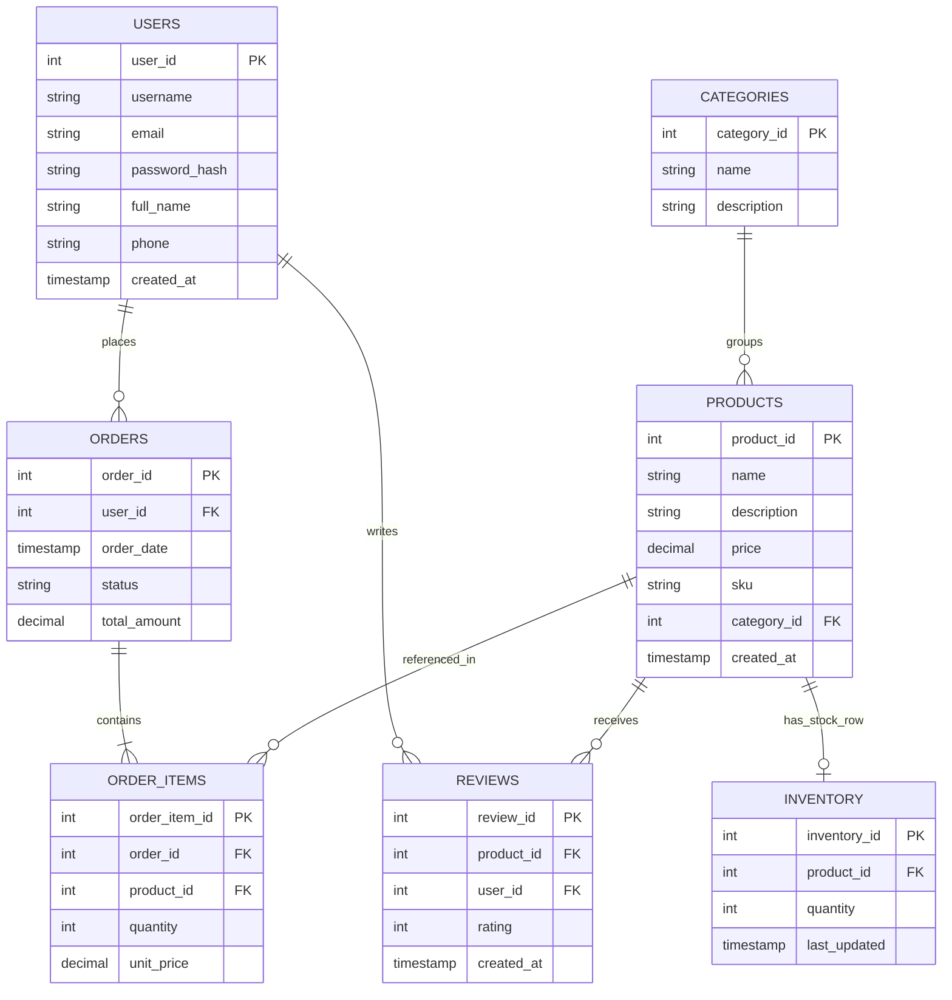

# Smart E-Commerce System

A layered Java/JavaFX e-commerce application built for the assignment's five epics:
DB design, CRUD, search/sort/caching, performance optimization, and documentation.

## Project Structure

```
ecommerce-system/
├── sql/
│   └── schema.sql            -- DDL: tables, constraints, indexes
├── nosql/
│   ├── reviews_schema.json   -- Document schema for flexible review content
│   └── logs_schema.json      -- Document schema for system access logs
├── src/main/java/rw/smart/ecommerce/
│   ├── Launcher.java             -- main() entry point
│   ├── MainApplication.java      -- JavaFX Application, opens the sign-in screen
│   ├── controller/               -- one controller per screen (see table below)
│   ├── core/<feature>/           -- model, dao, service (+ cache for product)
│   │   ├── product/  ── model | dao | service | cache
│   │   ├── category/ ── model | dao | service
│   │   ├── user/     ── model | dao | service
│   │   ├── order/    ── model (Order, OrderItem, CartItem) | dao | service | enums
│   │   ├── inventory/── model | dao | service
│   │   ├── review/   ── model (Review + ReviewContent) | dao (SQL + document) | service
│   │   └── log/      ── model | dao (document) | service | enums   <-- NoSQL only
│   └── utils/
│       ├── DBConnection.java         -- PostgreSQL (required)
│       ├── MongoConnection.java      -- document store (optional, lazy)
│       ├── BsonValues.java           -- lenient document field readers
│       ├── session/Session.java      -- the signed-in user
│       ├── ui/                       -- ViewLoader, Navigation, Notifier, Money, RefreshableView
│       ├── validation/RegexValidator.java
│       └── exceptions/               -- InvalidInput, InsufficientStock, DocumentStore
├── src/main/resources/rw/smart/ecommerce/
│   ├── *.fxml                -- one view per screen
│   ├── styles/app.css
│   └── (db.properties lives at the resources root)
└── src/test/java/rw/smart/ecommerce/   -- JUnit 5 + Mockito, mirrors the main tree
```

Layering is strict in both directions: controllers only call services, services only
call DAOs, and only DAOs contain SQL.

## ERD (Mermaid)



`ReviewContent` is the NoSQL document half of a review and joins on `review_id`.
It is intentionally left out of the relational ERD because its free-form content
belongs in `nosql/reviews_schema.json`, not in the SQL schema.

## NoSQL Strategy — Reviews & Logs (Hybrid Model)

The requirements list `Reviews` as a relational entity and ask for NoSQL modeling of
reviews. This is resolved with a deliberate hybrid, not a contradiction:

* **Relational `Reviews` table** — only `review_id, product_id, user_id, rating,
  created_at`. This is what needs strong referential integrity (a review must point
  to a real product/user) and needs to be aggregated with SQL (`AVG(rating)` for a
  product's star rating) — a relational strength.
* **NoSQL document store (MongoDB)** — holds the review's variable-shape content:
  free text, photo URLs, helpful-vote counts, seller responses, edit history, tags.
  This content varies review-to-review and would otherwise force many nullable
  columns or an EAV table in SQL, which hurts both 3NF and query performance.

`review_id` is the join key between the two halves.

### Collections

| Collection | Schema | Written by | Read by |
|---|---|---|---|
| `review_content` | `nosql/reviews_schema.json` | `ReviewContentDAO.save` (upsert) | reviews dialog |
| `logs` | `nosql/logs_schema.json` | `LogDAO.insert` (append-only) | Activity Log screen |

Logs are the second, purer NoSQL case: high-volume, write-heavy, schema-loose, never
joined, and read by recency / `user_id` / `event_type` / time range.

### How the two halves are kept honest

- **Write order is deliberate.** `ReviewService.submitReview` commits the rating to
  SQL *first*, then writes the document. A document-store outage therefore cannot
  cost a rating. If the content write then fails, `DocumentStoreException` reports
  exactly that ("Rating saved, but the review text could not be stored") instead of
  implying the whole submission was lost.
- **Server-owned fields survive author edits.** Re-saving content preserves
  `helpful_votes` and `seller_response` and pushes the superseded body onto
  `edit_history` (`ReviewContent.revisionOf`). Votes use an atomic `$inc`.
- **Reads are lenient.** The store has no schema to enforce, and the committed seed
  files use ISO-8601 strings where the driver writes BSON dates, so `BsonValues`
  accepts either and missing fields fall back to empty. An `event_type` this build
  does not know about still displays, falling back to the raw string.
- **The document store is optional infrastructure.** The client is built lazily with
  a short server-selection timeout, never during class initialization. With MongoDB
  down: the app starts, ratings and the SQL average still show, the reviews dialog
  and Activity Log show a banner explaining what is missing, and logging silently
  no-ops. Log writes go to a daemon thread, so a missing server never blocks the UI
  thread on the way through a checkout.
- **Connection details live only in `db.properties`** (`mongo.uri`,
  `mongo.database`), with no defaults compiled in — see Setup below.

## Application Screens

The app opens on **Sign In**. After authenticating, `MainShellController` owns a sidebar
and swaps the feature screens into the content area.

| Screen | View | Controller | Services used |
|---|---|---|---|
| Sign in | `login.fxml` | `LoginController` | `UserService.authenticate` |
| Create account | `register.fxml` | `RegisterController` | `UserService.register` |
| Shell (nav, sign out) | `main_shell.fxml` | `MainShellController` | `Session` |
| Shop + cart + checkout | `shop.fxml` | `ShopController` | `Product`, `Category`, `Inventory`, `OrderService.placeOrder` |
| My orders | `order_list.fxml` | `OrderListController` | `OrderService.getOrdersForUser` / `updateStatus` |
| Order detail | `order_detail.fxml` | `OrderDetailController` | `OrderService.getOrderItems`, `ProductService` |
| Reviews (hybrid) | `product_reviews.fxml` | `ProductReviewsController` | `ReviewService` (SQL rating + document content), `UserService` |
| Activity log | `activity_log.fxml` | `ActivityLogController` | `LogService` (document store only) |
| Products (CRUD) | `product_list.fxml` | `ProductListController` | `ProductService`, `CategoryService` |
| Product form | `product_form.fxml` | `ProductFormController` | `ProductService`, `CategoryService` |
| Categories (CRUD) | `category_list.fxml` | `CategoryListController` | `CategoryService` |
| Category form | `category_form.fxml` | `CategoryFormController` | `CategoryService` |
| Inventory / stock | `inventory_list.fxml` | `InventoryListController` | `InventoryService`, `ProductService` |
| My profile | `profile.fxml` | `ProfileController` | `UserService.getUser` / `updateProfile` |

Cross-cutting UI concerns are shared rather than duplicated per controller:
`ViewLoader` (loads views, applies stylesheets, opens modals), `Navigation` (whole-window
transitions), `Notifier` (toasts and confirmations), `Money` (two-decimal amounts).

Notes on behaviour worth knowing:

- **Stock is authoritative in the checkout transaction, not in the UI.** The shop screen
  shows stock so it can reject an obvious oversell early, but `OrderService.placeOrder`
  re-checks inside the transaction and rolls the whole order back on
  `InsufficientStockException` — a concurrent sale therefore cannot half-write an order.
- **New products have no `Inventory` row.** The inventory screen writes stock with an
  upsert (`INSERT ... ON CONFLICT`), so a product created in the product form can be
  given stock without a separate insert step.
- **One rating per user per product**, enforced by `UNIQUE (product_id, user_id)`.
  Re-rating updates the existing row (also an upsert) instead of failing.
- **`Status` must match the DB.** The enum values mirror the `CHECK` constraint on
  `Orders.status` (`PENDING`, `PAID`, `SHIPPED`, `DELIVERED`, `CANCELLED`); adding a value
  to one side without the other fails at insert/update time.
- **Screens are kept alive between visits.** The shell caches each loaded view so
  in-progress state (most importantly the cart) survives navigation, and calls
  `RefreshableView.onShown()` on re-entry so the data is still fresh.
- **Actions emit log events.** Sign in/out, registration, searches (with
  `results_count` and `cache_hit`), product/category CRUD, stock changes, orders
  placed or rejected, review submissions and profile edits all append a document to
  the `logs` collection, visible on the Activity Log screen.

## Setup Instructions

1. Create the database and run `sql/schema.sql` against PostgreSQL (or adapt syntax for your RDBMS of choice — `SERIAL`/`RETURNING` are Postgres-specific).
2. Run `sql/queries.sql` to seed sample categories, products, inventory and a user.
   (Its `password_hash` is a placeholder, so sign up through the app rather than
   signing in as that seed user.)
3. Update `src/main/resources/db.properties` with your database URL, username, password, and driver.
4. Run the app with `mvn clean javafx:run`, or run `Launcher.java` from your IDE.
5. Create an account on the sign-in screen, then use the sidebar: add categories and
   products, set stock on the Inventory screen, and place an order from Shop.

### Optional: the document store

Everything above works without MongoDB. To enable review content and the activity log:

1. Start MongoDB and set `mongo.uri` and `mongo.database` in `db.properties`. Both
   keys are **required** — `MongoConnection` has no built-in fallback host or
   database name, so the app can never silently talk to a different store than the
   one configured. A missing key degrades exactly like an unreachable server
   (banner shown, logging no-ops) and names the missing key in the message.
2. Optionally load the seed documents — both files are single documents matching the
   collection shapes the app reads:

```bash
mongoimport --db smart_ecommerce --collection review_content --file nosql/reviews_schema.json
```

```bash
mongoimport --db smart_ecommerce --collection logs --file nosql/logs_schema.json
```

The `_comment` field in each file is ignored by the mappers. The seed review content
points at `review_id` 10245 / `product_id` 501, so create a matching rating (or edit
the ids) if you want it to appear in the reviews dialog.

## Testing

```bash
mvn test
```

112 JUnit 5 tests, Mockito for the doubles, no database or MongoDB required — DAOs are
mocked, `DBConnection.getConnection()` is stubbed with Mockito static mocking, and the
document DAOs take their `MongoCollection` from an injected supplier.

| Area | What is asserted |
|---|---|
| `ProductServiceTest` | cache warmed once, case-insensitive search, sorting, write-through on create/update/delete, cache-miss fallback |
| `OrderServiceTest` | total derived from lines, `PENDING` on placement, stock decremented in the same transaction, rollback on both insufficient stock and SQL failure |
| `UserServiceTest` | plaintext never persisted, digest shape, register→authenticate round trip, wrong password and unknown email rejected |
| `InventoryServiceTest` | absent row reads as zero, negative stock rejected before the DB, refused decrement becomes `InsufficientStockException` |
| `ReviewServiceTest` | rating bounds, average rounding, ordering, hybrid write order, partial-failure reporting, degradation when the store is down |
| `LogServiceTest` | entry contents, unique ids, anonymous events, and that a store failure never propagates |
| `ReviewContent*Test`, `Log*Test` | mapping against the committed `nosql/*.json` seed files, upsert/edit-history/`$inc` semantics via a mocked collection |
| `CartItemTest`, `MoneyTest`, `RegexValidatorTest`, `CategoryServiceTest` | price snapshotting, money formatting, email rules, delegation |

## Performance Comparison: Before vs. After Indexing

Run `EXPLAIN ANALYZE` on the queries below (before and after creating the indexes in
`sql/schema.sql`) and record the output here. Template:

| Query | Before Index (plan/time) | After Index (plan/time) |
|---|---|---|
| `LOWER(name) LIKE '%mouse%'` | Seq Scan, ~X ms | Bitmap Index Scan on `idx_products_name_lower`, ~Y ms |
| `Orders WHERE user_id = ?` | Seq Scan, ~X ms | Index Scan on `idx_orders_user`, ~Y ms |

As table size grows, the sequential scan cost grows linearly (O(n)) while the indexed lookup stays near O(log n) — the gap widens with data volume, which is the core justification for the indexing strategy in Phase 1.

## Caching Behavior

- `ProductService` lazily loads all products into `ProductCache` (`HashMap<Integer, Product>`) on first access.
- Reads (`getProduct`, `getAllProducts`, `search`) are served from cache.
- Writes (`createProduct`, `updateProduct`, `deleteProduct`) update the DB first, then write-through to the cache (or remove the entry on delete) — so the cache is never stale after a mutation.

## Rubric Alignment

| Area | Where addressed |
|---|---|
| DB Design (25) | `sql/schema.sql`, ERD above, 3NF justification in Phase 1, hybrid NoSQL rationale above |
| SQL (20) | `sql/schema.sql`, `sql/queries.sql`, parameterized `PreparedStatement` patterns in every DAO |
| NoSQL | `nosql/*.json`, `core/review/dao/ReviewContentDAO`, `core/log/`, `utils/MongoConnection` |
| JavaFX + JDBC (20) | `controller/` (14 screens), `core/*/dao/`, `utils/DBConnection.java` |
| DSA (15) | `core/product/cache/ProductCache.java`, sort/search logic in `ProductService` |
| Optimization (10) | Indexing strategy in `sql/schema.sql`; single-query stock load in `InventoryService.getStockByProduct` avoids per-row N+1; async log writes keep the UI thread free |
| Testing | `src/test/java` — 112 JUnit 5 + Mockito tests (see Testing above) |
| Documentation (10) | This README + inline Javadoc comments |
