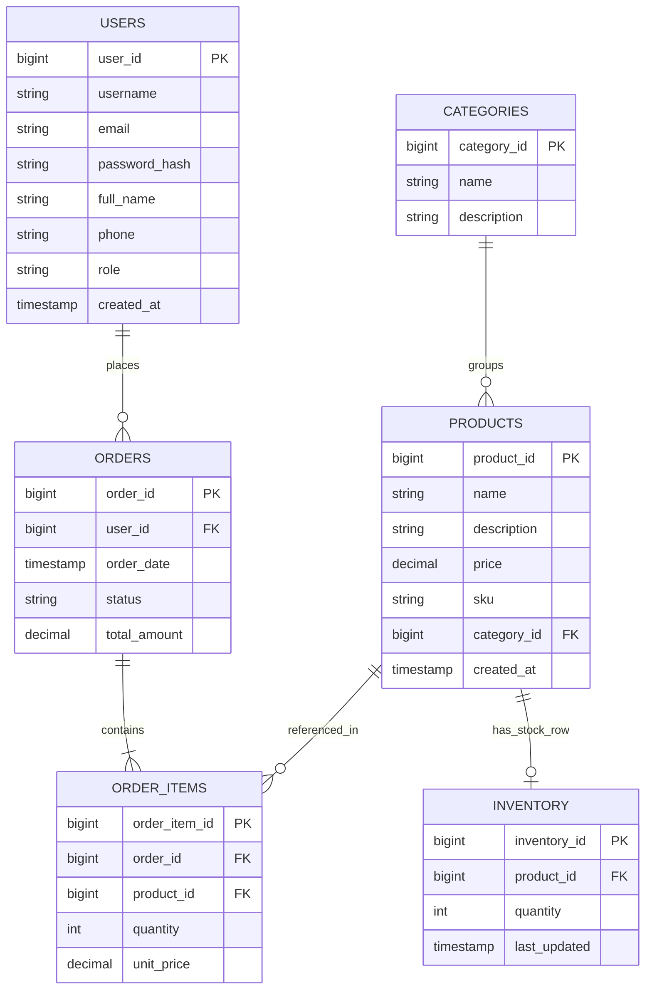

# Smart E-Commerce System

A Spring Boot 4 backend for an e-commerce catalogue, exposing the same business logic
over **REST** and **GraphQL**, backed by **PostgreSQL** for transactional data and
**MongoDB** for reviews and access logs.

Phase 1 was a JavaFX desktop application over raw JDBC. Phase 2 replaced it entirely —
the DAOs, the manual connection handling and the UI layer are gone, and the business
rules now live behind Spring Data repositories, a service layer and two API surfaces.

---

## Quick start

You need Java 21, PostgreSQL and MongoDB running locally.

```bash
createdb -U postgres smart_ecommerce_db
```

```bash
./mvnw spring-boot:run
```

That is the whole setup. The app creates its schema (`ddl-auto=update` in `dev`) and
seeds sample data on first start: 4 users, 5 categories, 12 products with stock,
2 orders and 4 reviews.

### Signing in

The seeder guarantees one administrator account exists, and prints it at startup:

| | |
|---|---|
| **email** | `admin@smartecommerce.rw` |
| **password** | `Admin@12345` |

Authentication is **HTTP Basic**. The username field accepts **either the e-mail address
or the username** — `admin@smartecommerce.rw` and `admin` both work, since both columns
are unique.

```bash
curl -u admin@smartecommerce.rw:Admin@12345 http://localhost:8080/api/v1/users
```

Seeded customers use `Customer@123` (`k.mugisha@example.com`, `j.doe@example.com`,
`a.ingabire@example.com`).

Override with `app.seed.admin-email` / `app.seed.admin-password`, or turn seeding off
with `app.seed.enabled=false`. The bootstrap check never modifies an account that
already exists, so a password you have changed yourself is safe.

**In Swagger UI**, click the **Authorize** button at the top of the page and enter the
same e-mail and password. Do not use the browser's own popup — the API deliberately does
not send a `WWW-Authenticate` challenge, precisely so that popup never appears.

### Where things are

| | |
|---|---|
| Swagger UI | http://localhost:8080/swagger-ui.html |
| OpenAPI document | http://localhost:8080/v3/api-docs |
| GraphiQL | http://localhost:8080/graphiql |
| GraphQL endpoint | http://localhost:8080/graphql |
| Health | http://localhost:8080/actuator/health |

### Upgrading an existing Phase 1 database

Two migrations, run once each, **before** starting the app:

```bash
psql -U postgres -d smart_ecommerce_db -f docs/sql/migration-phase2.sql
```

```bash
psql -U postgres -d smart_ecommerce_db -f docs/sql/migration-password-encoding.sql
```

The first adds `users.role` and moves `OrderItems` to `order_items`; `ddl-auto` can do
neither. The second tags existing SHA-256 hashes `{sha256}` so those accounts keep
working — each one silently re-hashes to BCrypt on its owner's next successful login.

---

## Project structure

```
src/main/java/rw/smart/ecommerce/
├── EcommerceApplication.java
├── config/                    -- application wiring
│   ├── CacheConfig            -- Caffeine caches, sized per staleness tolerance
│   ├── AsyncConfig            -- bounded executor for access logging
│   ├── MongoConfig            -- hand-wired mongodb-driver-sync client
│   ├── MongoSettings          -- app.mongo.* binding
│   ├── OpenApiConfig          -- document metadata + basicAuth scheme
│   └── DataSeeder             -- sample data + bootstrap admin (non-prod only)
├── security/                  -- one concern, one package
│   ├── SecurityConfig         -- filter chain, @EnableMethodSecurity, PasswordEncoder
│   ├── AppUserDetailsService  -- users table -> Spring Security, + hash upgrade
│   ├── LegacySha256PasswordEncoder
│   ├── RestAuthenticationEntryPoint   -- 401 as JSON, no browser popup
│   └── RestAccessDeniedHandler        -- 403 as JSON
├── core/<feature>/            -- user, category, product, inventory, order, review, log
│   ├── model/                 -- JPA entities (or Mongo documents for review/log)
│   ├── enums/                 -- plain constant lists
│   ├── dao/                   -- Spring Data repositories (+ Mongo repositories)
│   ├── dto/                   -- validated requests, response projections
│   ├── service/ + service/impl
│   └── controller/            -- one REST controller + one GraphQL controller
└── utils/                     -- genuinely shared helpers
    ├── response/              -- StandardResponse, PageResponse
    ├── exceptions/            -- domain exceptions + handler/
    ├── pagination/            -- PaginationSupport (sort whitelist)
    ├── aspect/                -- ExecutionTimeAspect
    └── BsonValues
```

Each feature owns its whole vertical slice. There is **one controller per feature**, not
one for admins and one for customers — the resource is the same either way, and only the
permission differs.

---

## API design

### Personas are separated by role, not by URL

```java
@GetMapping                                  // public
public ... browse(...) { }

@Operation(summary = "Create a product (Admin only)")
@PreAuthorize("hasRole('ADMIN')")            // admin
@PostMapping
public ... create(@Valid @RequestBody ProductRequest request) { }
```

Catalogue reads are public. Everything else requires authentication, and management
operations require `ADMIN`. Unauthenticated requests get **401**, authenticated ones
without the role get **403** — both in the standard envelope.

### Every REST response uses one envelope

```json
{ "status": 200, "message": "12 product(s) found", "data": { } }
```

Errors use the same shape, so a client parses one structure and branches on `status`.
Validation failures put the field errors in `data`:

```json
{
  "status": 400,
  "message": "Validation failed for 2 field(s)",
  "data": { "price": "Price cannot be negative", "name": "Product name is required" }
}
```

### Catalogue query

```
GET /api/v1/products?keyword=mouse&categoryId=3&minPrice=10&maxPrice=80
                    &sortBy=price&direction=DESC&page=0&size=20
```

All parameters optional. `sortBy` is checked against a whitelist, so a bad value returns
400 instead of leaking a Spring Data `PropertyReferenceException` as a 500.

### SKUs are generated, never supplied

Format `CAT-YYMM-NNNNN` — `PER-2608-00042` is Peripherals, August 2026, product 42.

The tail is the primary key, so the SKU is unique by construction: no uniqueness query,
no counter table, no retry on collision. It is assigned once and never regenerated —
moving a product to another category keeps the original prefix, because the SKU is on
labels and on historical order lines.

---

## GraphQL

Same services, same repositories, different transport:

```
GraphQL -> @Controller + @QueryMapping/@MutationMapping -> @Service -> @Repository -> DB
```

The repositories carry plain `@Repository`. `@GraphQlRepository` — which auto-exposes a
repository as a data fetcher — is deliberately **not** used, because it would let GraphQL
reach the database without passing through the service layer, skipping `@Transactional`,
`@PreAuthorize`, caching, the monitoring aspect and DTO mapping. Two transports, one set
of rules.

### Batched field resolution (DataLoader)

`Product.reviewSummary` is resolved by `@BatchMapping`, Spring for GraphQL's DataLoader
wrapper:

```graphql
{
  products(filter: { size: 20 }) {
    content { id name reviewSummary { averageRating reviewCount } }
  }
}
```

Resolved per product, that is 20 MongoDB aggregations for one screen. Batched, it is
**one** `$match: { productId: { $in: [...] } }`. Measured: 12 products → 1 aggregation,
and **0** when the field is not selected, since GraphQL only resolves what was asked for.

`category` and `stockQuantity` are *not* batch-resolved, and do not need to be — the
service already fetch-joins the category and loads stock for a whole page in one query,
so a DataLoader there would add machinery for no gain.

### Authorization lives on the methods

`/graphql` is a single POST endpoint, so URL rules cannot distinguish a public catalogue
query from a private one. Every non-public query and mutation carries its own
`@PreAuthorize`. There is no path rule underneath acting as a safety net, which *is* true
for REST — a difference that already caused one real defect (see the performance report,
§6.6).

---

## Security

| | |
|---|---|
| Authentication | HTTP Basic over the `users` table, by e-mail |
| Authorization | `@PreAuthorize` with `@EnableMethodSecurity` |
| Password hashing | BCrypt via `DelegatingPasswordEncoder` |
| Legacy hashes | `{sha256}` read-only, auto-upgraded to `{bcrypt}` on next login |
| Sessions | none — stateless |

Stored hashes carry their algorithm as a `{prefix}`, which is what makes the next
algorithm change a one-line edit instead of a migration.

**Known cost:** because the API is stateless, credentials are verified on *every*
request, and BCrypt is deliberately slow. That is ~95 ms per authenticated call. See the
performance report §6.5 — it is the largest single optimization still available.

---

## Data model

PostgreSQL owns anything that must be transactional; MongoDB owns anything whose shape
varies or that is written far more often than it is read.



**MongoDB collections** (no foreign keys — the link is by value):

- `reviews` — rating, comment, tags, photos, helpful votes. Variable shape: some reviews
  have photos, most do not. Relationally that is a wide table of nullable columns.
- `access_logs` — one document per service-method invocation, written by the monitoring
  aspect. Append-only, never joined, read by time range.

Why the split matters in practice: placing an order writes an order, N items and N stock
decrements, and either all of it happens or none does. That is what `@Transactional` and
foreign keys give you, and it is not something to hand-roll.

`Inventory` is 1:1 with `Product` rather than a column on it, because stock changes far
more often than product metadata.

---

## How correctness is enforced

**Order placement** is the one operation that genuinely needs ACID. Stock is reserved
with a conditional update:

```sql
UPDATE inventory SET quantity = quantity - :amount
WHERE product_id = :productId AND quantity >= :amount
```

Zero rows updated means insufficient stock — check and decrement in one statement, with
no read-then-write race. If any line fails, the whole order rolls back: no partial order,
no stock reserved against an order that was never created.

**Order status** follows an explicit state machine — `PENDING → PAID → SHIPPED →
DELIVERED`, with `CANCELLED` reachable from `PENDING` or `PAID`, and `DELIVERED` /
`CANCELLED` final. Cancelling returns the reserved stock.

**Deletes are guarded**: a product that appears in an order and a category still holding
products both return 409 rather than surfacing a foreign-key violation.

---

## Performance

| Optimization | Where | Effect |
|---|---|---|
| Caffeine caches | `CacheConfig` | 5 product reads → 1 service call; bounded and expiring, unlike the Phase 1 static map |
| Batched stock lookup | `ProductServiceImpl.browse` | one query per page, not per row |
| Fetch-joined category | `ProductSpecifications` | no lazy load per row |
| `@BatchMapping` | `Product.reviewSummary` | 12 aggregations → 1 |
| Async access logging | `AccessLogServiceImpl` | MongoDB write off the request thread |
| Connection pooling | HikariCP | removed the ~96 ms per-call connect cost measured in Phase 1 |
| Response compression | `server.compression` | JSON catalogue pages |

Caches are correct by eviction, not by TTL — every path that moves stock evicts the
product cache, since a cached product carries a stock figure.

Full measurements, including a REST vs GraphQL comparison, are in
[docs/performance-report.md](docs/performance-report.md).

---

## Configuration

Four `.properties` files, no YAML:

| Profile | Schema | Notes |
|---|---|---|
| `application.properties` | — | shared settings, `dev` active by default |
| `dev` | `update` | local credentials, SQL logging, all actuator endpoints |
| `test` | `create-drop` | separate database, **seeding disabled** so tests own their fixtures |
| `prod` | `validate` | every secret from `${ENV}`, Swagger UI off, schema changes ship as reviewed migrations |

`spring.jpa.open-in-view=false` throughout, so lazy loading cannot leak into
serialization — services map to DTOs inside the transaction.

There is no embedded database on the classpath, so the `test` profile points at a real
PostgreSQL database:

```bash
createdb -U postgres smart_ecommerce_test_db
```

### Phase 3 profiling settings

The four files are **git-ignored** — they carry database credentials — so the settings
added in Phase 3 are recorded here as the reviewable copy. Apply them to your local
files.

`application.properties` (shared, all profiles):

```properties
spring.jpa.properties.hibernate.generate_statistics=false
spring.jpa.properties.hibernate.session.events.log.LOG_QUERIES_SLOWER_THAN_MS=0
spring.jpa.properties.hibernate.default_batch_fetch_size=25
spring.jpa.properties.hibernate.query.fail_on_pagination_over_collection_fetch=true
spring.jpa.properties.hibernate.query.plan_cache_max_size=512
```

`default_batch_fetch_size` is the one that matters. The paginated order list reads a
page of orders and then needs each order's lines; without batching that is one statement
per order. Fetch-joining the collection instead is not an option — a join fetch combined
with `LIMIT` returns the wrong page, and Hibernate's fallback is to read every matching
row and page in heap. `fail_on_pagination_over_collection_fetch` turns that fallback
into an exception at development time instead of a table scan in production.

`application-dev.properties` — everything on, because this is where an accidental N+1 is
meant to be noticed:

```properties
spring.jpa.properties.hibernate.generate_statistics=true
spring.jpa.properties.hibernate.session.events.log.LOG_QUERIES_SLOWER_THAN_MS=50
logging.level.org.hibernate.stat=DEBUG
logging.level.org.hibernate.SQL_SLOW=INFO
logging.level.org.springframework.cache=TRACE
logging.level.org.springframework.transaction.interceptor=TRACE
```

`logging.level.org.springframework.cache=TRACE` prints every hit, miss and eviction,
which is the only practical way to confirm an eviction rule fires on the write path it
was written for.

`application-test.properties` — statistics are asserted on by the query-count tests, so
they are collected here regardless of what dev is set to:

```properties
spring.jpa.properties.hibernate.generate_statistics=true
logging.level.org.springframework.transaction.interceptor=DEBUG
```

`application-prod.properties` — statistics off, slow-query log on. The slow-query log
costs nothing until a statement is actually slow, and it is the first thing anyone asks
for when the service is reported slow:

```properties
spring.jpa.properties.hibernate.generate_statistics=false
spring.jpa.properties.hibernate.session.events.log.LOG_QUERIES_SLOWER_THAN_MS=500
logging.level.org.hibernate.SQL_SLOW=WARN
```

---

## Build and test

```bash
./mvnw clean test
```

```bash
./mvnw spring-boot:run -Dspring-boot.run.profiles=prod
```

**Test coverage is currently one context-load test.** The Phase 1 suites (116 tests)
covered DAOs and services that no longer exist and were removed with them. Rewriting
them against the Spring stack — `@DataJpaTest` for repositories, Mockito for services,
`@WebMvcTest` for controllers — is the largest outstanding piece of work.

---

## Documentation

| | |
|---|---|
| [docs/project-implementation.md](docs/project-implementation.md) | how the code works and why, in plain language |
| [docs/performance-report.md](docs/performance-report.md) | indexing study, application-layer measurements, REST vs GraphQL |
| [docs/sql/schema.sql](docs/sql/schema.sql) | Phase 1 DDL, still the reference for column shapes |
| [docs/sql/migration-phase2.sql](docs/sql/migration-phase2.sql) | Phase 1 → Phase 2 schema migration |
| [docs/sql/migration-password-encoding.sql](docs/sql/migration-password-encoding.sql) | password hash format migration |
| [docs/nosql/](docs/nosql/) | document schemas for reviews and logs |

---

## Known gaps

Recorded rather than hidden:

1. **Ownership is not checked on orders.** `GET /orders?userId=…` and
   `ordersByUser(userId:)` verify that the caller is signed in, not that the orders are
   theirs. Needs a check comparing the authenticated principal to the order's owner, with
   `ADMIN` exempt.
2. **BCrypt runs on every request** (~95 ms). The cost belongs at login; a session or a
   short-lived token would pay it once.
3. **No GraphQL depth or complexity limit.** A sufficiently nested query can cost far
   more than any REST endpoint.
4. **Test coverage**, as above.
