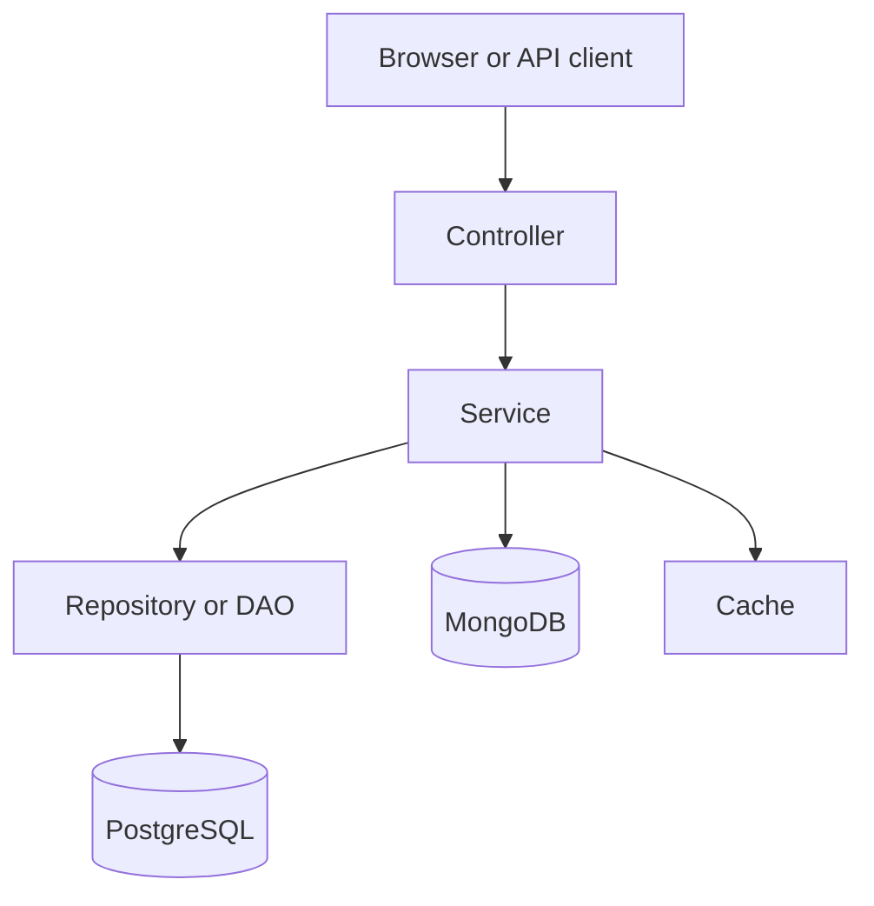

# Project Implementation Explained

This document explains the current codebase in simple language. It focuses on what the project does, why each part exists, how the main pieces work together, and why the code was built this way.

One important note: the source code in this repository is the real source of truth. If any old notes or older project descriptions say something different, this document follows the code that is actually in `src/main/java` and `src/main/resources`.

## 1. What This Project Is

This is a backend e-commerce system built with Spring Boot. It exposes web endpoints for products, categories, users, orders, reviews, logs, and docs.

It is not one big block of code. It is split into small parts so each part has one job.

The project uses:

- PostgreSQL for the main business data
- MongoDB for flexible review content and access logs
- Spring Security for login and access rules
- Caffeine cache for faster reads
- Spring GraphQL for queries that fit better in GraphQL form
- SpringDoc OpenAPI for Swagger UI and API docs
- JPA for normal database work
- Maven to build and manage the project

The main idea is simple: keep strict data in PostgreSQL, keep loose data in MongoDB, make repeated reads fast with cache, and keep the code split by concern.

## 2. Why The Project Was Built This Way

The design follows a few basic rules.

### 2.1 Keep the app easy to understand

Each feature lives in its own package. For example, products, orders, users, reviews, and categories each have their own folder tree. This makes it easier to find code and easier to change one feature without breaking the rest.

### 2.2 Keep data safe

Important business data, like users, orders, products, and stock, is stored in PostgreSQL because that kind of data should stay strict and consistent.

Some other data changes shape more often, like review text and access logs. That data is better suited to MongoDB because it can store flexible documents.

### 2.3 Keep common reads fast

Some screens are opened many times, especially product pages, category lists, and review summaries. Those are cached so the app does not keep asking the database for the same thing over and over.

### 2.4 Keep errors controlled

Instead of letting random errors bubble up to the browser, the app catches them in one place and sends a clean response. That makes the app easier to use and easier to debug.

### 2.5 Keep the app secure but simple

The app uses normal Spring Security rules instead of a custom login system. The goal is to protect what needs protection without building a complicated security stack that is hard to maintain.

## 3. Main Tech Stack And Why It Was Chosen

| Tool or framework | Why it is used | What it does in the project |
|---|---|---|
| Java 21 | Modern language version with long-term support style features | Runs the application code |
| Spring Boot 4.1 | Reduces setup work and wires most things automatically | Starts the app, configures web, security, cache, and data layers |
| Spring Web MVC | Handles HTTP requests | Lets the app expose REST endpoints and pages like `/` |
| Spring Data JPA | Makes database work easier | Lets the code work with PostgreSQL through Java objects |
| PostgreSQL | Strong, reliable relational database | Stores users, orders, products, categories, and inventory |
| MongoDB driver | Direct driver for MongoDB | Stores review documents and access logs |
| Spring Security | Login and access control | Protects endpoints and checks user roles |
| Spring GraphQL | GraphQL endpoint support | Gives a second API style for clients that want it |
| SpringDoc OpenAPI | API documentation | Powers Swagger UI and the OpenAPI spec |
| Caffeine | Fast in-memory cache | Reduces repeated database reads |
| Lombok | Cuts down repeated boilerplate code | Generates getters, loggers, and constructors where needed |
| JUnit and Mockito | Testing tools | Used for unit and integration tests |
| Maven | Build tool | Downloads dependencies, compiles code, and runs tests |

### Why not use a single tool for everything?

Because different data needs different storage. Strict business records fit PostgreSQL. Flexible review and log data fit MongoDB. Fast repeat reads fit cache. The project uses the simplest tool for each job instead of forcing one tool to do everything.

## 4. Project Structure

The code is split by feature and by job.

### Main app files

- `EcommerceApplication.java` is the boot class. It starts Spring Boot.
- `src/main/resources/application.properties` sets shared runtime settings.
- `src/main/resources/application-dev.properties` and `application-prod.properties` set profile-specific settings.
- `src/main/java/rw/smart/ecommerce/security` contains login and access rules.
- `src/main/java/rw/smart/ecommerce/config` contains startup and support setup such as cache, Mongo, Swagger, and seeding.
- `src/main/java/rw/smart/ecommerce/core` contains the business features.
- `src/main/java/rw/smart/ecommerce/utils` contains shared helpers like pagination, error handling, and BSON reading.

### Feature folders

Each feature normally follows the same pattern:

- `controller` receives the HTTP request
- `service` holds the business rules
- `dao` talks to the database or document store
- `model` stores the data shape
- `dto` carries input and output data

That shape is repeated for products, users, orders, categories, reviews, and logs.

## 5. How The App Starts

The app starts in `EcommerceApplication.java`.

Spring Boot reads the settings from the properties files, creates the needed beans, and starts the web server on port 8080.

The default profile is `dev`, so a plain local start uses the developer settings unless a different profile is chosen.

In the shared properties file, the app also sets:

- server port
- base path `/`
- GraphQL path `/graphql`
- Swagger paths
- cache settings
- Mongo settings
- pagination defaults

That means one startup file controls the shared behavior, and the profile files control the environment-specific values.

## 6. The Main Request Flow

The flow is the same for most features.



### In plain words

1. A browser or API client sends a request.
2. A controller receives it.
3. The controller does almost no heavy work.
4. The controller calls a service.
5. The service checks the rules.
6. The service talks to the database or document store through a DAO.
7. The service returns a response object.
8. The controller sends the result back.

This split matters because it keeps the rules in one place and keeps the web layer thin.

## 7. Why Controllers Are Kept Thin

Controllers are only the door into the app. They should not contain all the business logic.

That choice helps in three ways:

- The code is easier to read.
- The code is easier to test.
- The same rules can be used from REST and GraphQL if needed.

The controller decides what path is being called and what input is coming in. The service decides what should happen.

## 8. What The Service Layer Does

The service layer is where the real rules live.

### 8.1 Product service

The product service handles:

- creating products
- updating products
- reading one product
- browsing product lists
- deleting products

It also handles stock lookup and cache removal.

Important design choices:

- Every product gets an inventory row right away.
- Stock is read in bulk for a whole page, not one row at a time.
- Product detail data is cached.
- Updating or deleting a product clears the related cache entry.
- A product cannot be deleted if it is already used in orders.
- Review documents for a deleted product are cleaned up separately.

Why this matters:

- No missing stock row needs special handling later.
- Bulk stock lookup saves database trips.
- Cache keeps common reads fast.
- Safety checks protect order history.

### 8.2 Order service

The order service handles:

- placing orders
- reading one order
- reading a user's orders
- reading all orders
- changing order status

Important design choices:

- Placing an order is wrapped in one transaction.
- Stock is reserved during the same operation.
- If one line fails, the whole order fails.
- Order items store the product price at the time of purchase.
- Cancelled orders give stock back.
- Order status changes are limited to allowed next steps only.
- Changing order status clears product cache because stock may have changed.

Why this matters:

- No half-finished orders.
- Stock stays correct.
- A later price change does not rewrite old orders.
- Order history stays in a sensible order.

### 8.3 User service

The user service handles:

- creating users
- updating users
- reading one user
- reading all users
- searching users
- deleting users

Important design choices:

- Email must be unique.
- Username must be unique.
- Passwords are hashed before storage.
- A user cannot be deleted if they already have orders.
- Search supports paging and sorting.

Why this matters:

- Users do not overwrite each other by mistake.
- Passwords are not stored as plain text.
- Old order records are protected.
- Search stays fast and controlled.

### 8.4 Review service

The review service is a hybrid of PostgreSQL and MongoDB.

It handles:

- creating a review
- reading reviews for a product
- reading review summaries
- marking a review as helpful
- deleting a review

Important design choices:

- Product and user ids are checked first in PostgreSQL.
- The review content is saved in MongoDB.
- Only one review per user per product is allowed.
- Review summaries are cached.
- Helpful votes are updated with one atomic database update.

Why this matters:

- The app does not trust document data without checking the real ids first.
- Flexible review text can change shape without changing the SQL schema.
- Duplicate reviews are blocked.
- Summary reads are fast.
- Helpful votes do not overwrite each other during concurrent use.

## 9. Why PostgreSQL Is Used For The Main Data

PostgreSQL is used for the core business data because that data must stay correct.

That includes:

- users
- products
- categories
- inventory
- orders
- order items
- relational review rating records if needed by the design

Why it fits:

- It keeps relationships strict.
- It can stop invalid deletes with foreign keys.
- It is good for joins.
- It is good for totals, summaries, and ordered lists.

Examples from the code:

- an order points to a real user
- a product points to a real category
- an order item points to a real order and product
- inventory points to a product

This gives the app strong safety for business data.

## 10. Why MongoDB Is Used

MongoDB is used for data that is not fixed in shape.

In this project that is mostly:

- review documents
- access logs

### Why review content fits MongoDB

Review content can change more often than the main business tables.
A review may have:

- title
- comment
- tags
- helpful votes
- edit history
- seller replies
- media links

That kind of data does not always fit nicely into a fixed table with many columns.

### Why logs fit MongoDB

Logs are written often and read mostly by filters like time or type.
They are not meant to be joined into the main business flow.
A document store works well for that.

### Why the app uses the Mongo driver directly

The project uses `mongodb-driver-sync` instead of the Spring Data Mongo starter.
That means the Mongo setup is explicit and simple.

The code decides when to connect and how long to wait.
If MongoDB is missing, the app can still start and still serve the main app.

That is a deliberate choice so the app does not break just because the optional document store is down.

## 11. Cache Strategy

The project uses cache for data that is read often and changes less often.

The cache lives in `CacheConfig`.

Cached items include:

- products
- categories
- review summaries

### Why cache is used

Without cache, the app would keep asking the database the same question again and again.
That wastes time and adds load.

With cache:

- the first read fills the cache
- later reads are faster
- writes clear the related cache so stale data does not stay around

### Why different caches have different sizes and life times

Not every data type changes at the same speed.

- Product detail changes more often because stock changes.
- Categories change rarely.
- Review summaries are expensive to compute but can be a little stale without hurting the user.

So each cache gets its own size and time limit.

### Why not use one big cache for everything

Because one size does not fit all.
Some values can stay longer. Some must change quickly. One global rule would be too loose for some data and too strict for other data.

## 12. Pagination And Sorting Design

The app does not return giant lists all at once.
It uses paging and sorting.

That logic is in `PaginationSupport`.

### What it does

- turns page number, page size, sort field, and sort direction into a safe `Pageable`
- limits the maximum page size
- rejects bad sort fields
- uses default values when the client leaves a value out

### Why this matters

If the app accepted any sort field without checking it, a typo could become a server error.
If the app allowed huge page sizes, a client could accidentally ask for too much data and slow the app down.

So the helper keeps the input safe and predictable.

### How the code keeps it fast

- only allowed fields can be used for sorting
- page size is capped
- product stock for a page is loaded in one query instead of one query per row

That keeps large lists from becoming slow.

## 13. Security Design

Security is split into a few simple parts.

### 13.1 Login checks

`SecurityConfig` defines the login rules.

The app uses HTTP Basic for protected routes, which is simple and fits the current project size.

The current security setup allows public access to:

- `/`
- `/favicon.ico`
- Swagger docs routes
- the OpenAPI JSON route
- GraphiQL route
- health and info actuator routes
- some public read routes

Other routes still require login.

### 13.2 How a login works

`AppUserDetailsService` loads the user from the users table by **e-mail first, then
username**. Both columns are unique, so either value identifies exactly one account.

Accepting both is a deliberate concession to how sign-in forms are labelled. Swagger UI's
Authorize dialog, like almost every login form, calls the field "Username" — so an
account whose username is `admin` will have `admin` typed into it. Accepting only the
e-mail there produced a 401 that looked identical to a wrong password, with nothing in
the message to suggest the value itself was in the wrong format.

Whichever value is used, the authenticated principal is always the **e-mail address**.
That keeps one identity in the security context, so the password-upgrade path in
`updatePassword` always resolves the same row.

Then Spring Security checks the password with the configured `PasswordEncoder`.

### 13.3 Password hashing

Passwords are never stored as plain text.

The app uses:

- BCrypt for new passwords
- legacy SHA-256 support for older stored rows

Why this matters:

- BCrypt is stronger for stored passwords.
- Old users are not locked out while older hashes still exist.
- The password algorithm can change later without changing every class.

### 13.4 Why method security is used

The app uses method-level checks with `@PreAuthorize`.

That means some rules are checked right where the work happens, not only at the web door.

Why this matters:

- admin-only actions stay protected
- the rule is attached to the code that needs it
- it is harder to forget protection for a sensitive action

### 13.5 Swagger access

Swagger UI is made public so the docs page can open without a login prompt.
The root path `/` redirects to Swagger UI through `Home`.
That makes the browser land on the docs page first instead of a missing-resource error.

To call a protected endpoint from Swagger UI, use the **Authorize** button at the top of
the page and enter an account e-mail and password. That is what the `basicAuth` security
scheme in `OpenApiConfig` is for — without it declared, Swagger UI shows no Authorize
button at all and every secured endpoint just answers 401 with no way forward.

### 13.6 Why the API never sends a `WWW-Authenticate` challenge

Spring Security's default HTTP Basic entry point answers an unauthenticated request with
`401` **and** the header `WWW-Authenticate: Basic realm="Realm"`, with an empty body.

That header is an instruction to browsers, and browsers obey it. Chrome intercepts the
response before any JavaScript on the page can see it and opens its own native sign-in
dialog. Inside Swagger UI the effect is that the browser prompt appears *instead of* the
request completing: the page sits on "LOADING" behind a popup that has nothing to do with
Swagger's own Authorize flow, and whatever is typed into it does not become the header
Swagger is trying to manage.

`RestAuthenticationEntryPoint` replaces that default. It returns the same 401 status,
adds the standard response envelope as a body, and simply does not send the challenge
header. Consequences:

- Browsers no longer pop up a dialog, so Swagger UI renders the 401 inline like any other
  response.
- Non-browser clients are unaffected. `curl -u` sends Basic credentials preemptively and
  never needed the challenge to begin with.
- A filter-level 401 now looks exactly like one raised by the controller advice, instead
  of being the only error in the API with an empty body.

`RestAccessDeniedHandler` does the same job for filter-level 403s.

## 14. Error Handling Design

The app uses one shared error handler: `GlobalExceptionHandler`.

### Why this is useful

Without a shared handler, every controller would need to handle the same problems again and again.
That would lead to repeated code and inconsistent responses.

### What it does

It turns common problems into clean HTTP responses.

Examples:

- bad input becomes 400
- missing data becomes 404
- duplicate data becomes 409
- no permission becomes 403
- not logged in becomes 401
- document store trouble becomes 502
- unknown errors become 500

### Why the responses are wrapped

The app uses a common response shape for both success and failure.
That makes client code easier because it always sees a predictable format.

### Why stack traces are not sent to the browser

Because internal details should stay in the server logs, not be shown to users.
That is safer and cleaner.

## 15. Startup Data Seeding

The app has a seeder in `DataSeeder`.

### What it does

On startup, in non-production mode, it can create sample data:

- users
- categories
- products
- inventory
- orders
- reviews

### Why this exists

A fresh project should not open with empty screens.
Seed data makes the app useful right away for local work, demos, and tests.

### Why it is safe

- it does not run in production
- it skips tables that already have data
- it uses transactions for the relational part
- the Mongo part is best effort so an optional document store problem does not stop the app

### Seeded password design

Seed users have encoded passwords, not plain text. That keeps the example data close to real app behavior.

No password is written into this repository at all — not in the code, not in the
README, not in the OpenAPI document. There used to be one, and it was the same
literal string in five places. A default password is worse than no default: it is
guessable precisely because it is documented, and documenting it is what makes it
convenient enough that nobody changes it.

Instead:

- If `app.seed.admin-password` is set, that value is used and is **never logged**.
  A password an operator chose may well be one they use elsewhere, and log files
  outlive the terminal somebody read them in.
- If it is unset, one is generated from `SecureRandom` for that run and **printed
  once** at startup. A generated credential nobody can read is just a locked
  account, so this one has to be shown. It is the same bargain Spring Boot strikes
  with its own default security user.

The seeder never runs under the `prod` profile, so neither branch can put a
password into a production log.

### 15.1 The bootstrap administrator — how to log in

The seeder always makes sure one administrator account exists, at
`app.seed.admin-email` (default `admin@smartecommerce.rw`). Its password comes from
the rule above, and is printed as a warning in the startup log so it is never a
guess:

```
==========================================================
 Bootstrap administrator account created
   email    : admin@smartecommerce.rw
   password : <generated for this run, or a note that yours was used>
 Change this before exposing the service to anyone else.
 Disable with app.seed.enabled=false
==========================================================
```

Sign in with HTTP Basic, using the **email address**, not the username:

```bash
curl -u 'admin@smartecommerce.rw:<the password from your log>' http://localhost:8080/api/v1/users
```

This check runs **separately from the sample-data seeding**, and that separation is the
whole point.

The sample-data blocks skip entirely when a table already has rows. That is correct for
demo data, but it means a database carried over from Phase 1 keeps whatever accounts it
already had — and in that database the only administrator row stores the literal text
`HASHED_PW`, which is a placeholder, not a hash of anything. No password can ever match
it. The result was a database with an admin account nobody could sign in as, and no way
to reach an admin endpoint to fix it.

The bootstrap check closes that hole. It also never touches an account that already
exists, so it cannot undo a password an operator deliberately changed.

## 16. Why The Controllers Are Split By Feature

Each feature has its own controller instead of putting everything into one huge controller.

This keeps the code easier to work with.

Benefits:

- product code stays near product code
- order code stays near order code
- user code stays near user code
- tests are easier to write
- bugs are easier to find

## 17. What The DTOs Are For

DTO means data transfer object.
That is just a small object used to carry input or output data.

The app uses DTOs so it does not send raw database entities directly to the client.

Why this is better:

- the client gets only the fields it needs
- the database model can stay private
- the request shape can be different from the database shape
- fields can be validated before use

## 18. How The App Keeps Data Correct

Several small decisions work together here.

### 18.1 Transactions

A transaction means a group of database actions should succeed together or fail together.

This is used for things like:

- placing an order
- updating user data
- creating products with stock

Why this matters:

- no half-finished changes
- no stock lost without an order
- no order created without stock being reserved

### 18.2 Uniqueness checks

The app checks for unique email and username values, and blocks duplicate review writes
(one review per user per product).

Why this matters:

- two users do not share the same email or username
- a single user cannot rate the same product twice

SKU uniqueness is handled differently. It is not checked, because it cannot collide —
see the next section.

### 18.2.1 How the SKU is generated

A caller never sends a SKU. The server builds it, in `SkuGenerator`.

The format is `CAT-YYMM-NNNNN`:

```
PER-2608-00042
^   ^    ^
|   |    +-- product id, padded to five digits
|   +------- year and month the product was introduced
+----------- three letters taken from the category name
```

So a product added to *Peripherals* in August 2026 with id 42 gets `PER-2608-00042`.

Why the id is part of it:

- The id is already unique, so the SKU is **unique by construction**. There is no
  uniqueness query, no counter table, and no retry when two admins create a product at
  the same moment.
- The trade-off is one extra `UPDATE`. The id only exists after the row is inserted, so
  the product is saved once to get the id, then stamped with the SKU. Both writes are in
  the same transaction, so a failure leaves nothing behind.

Why it never changes afterwards:

- The SKU goes on a label and appears on past order lines.
- If a product is moved to another category later, the SKU keeps its original prefix.
  That is on purpose. The prefix records where the product started, which is a fact;
  rewriting it would break labels and old paperwork to chase a detail nobody relies on.

Why the caller does not choose it:

- A client-chosen SKU means trusting every client to keep a global rule.
  That is the database's job, not theirs.
- REST ignores a `sku` field if one is sent. GraphQL rejects it outright, because the
  schema no longer declares it.

### 18.3 Relationship checks

Before deleting something, the code checks if it is still used elsewhere.

Examples:

- do not delete a product if it exists in orders
- do not delete a user if they already have orders

Why this matters:

- history stays readable
- foreign key errors are turned into helpful messages

### 18.4 Stock checks

Stock is checked before and during order placement.

Why this matters:

- the UI can warn early
- the transaction still protects the real stock value
- two users cannot oversell the same item without the app noticing

## 19. Performance Strategy In Simple Words

The app is not trying to be clever. It is trying to avoid wasted work.

### Main performance choices

- cache common reads
- cap page size
- whitelist sort fields
- load stock in one batch for a page
- use indexes in MongoDB
- keep transactions only where needed
- use read-only transactions for reads
- use server-side summary calculation for reviews

### Why each helps

- Cache avoids repeat database trips.
- Page size caps stop huge accidental reads.
- Sort field checks prevent bad requests from turning into server failures.
- Batch stock loading avoids many tiny database calls.
- Mongo indexes make review reads and uniqueness checks faster.
- Read-only transactions make intent clear and can help the database optimize.
- Server-side summary calculation avoids moving all review rows into app memory.

### Why the app does not over-optimize

Over-optimizing too early makes the code hard to read.
This project chooses simple speed wins that are easy to explain and easy to maintain.

## 20. Swagger, OpenAPI, and Why They Are Included

Swagger UI is included so the API can be explored in the browser.

### What Swagger does

- shows the API paths
- shows request and response shapes
- lets you try endpoints
- helps with testing and documentation

### Why OpenAPI is in the code

The OpenAPI config describes the API at a document level.
It also declares the HTTP Basic auth scheme so Swagger has an `Authorize` button that actually works.

### Why this is useful

It saves time during development and makes the API easier for other people to understand.

## 21. Why GraphQL Is Included

GraphQL is useful when the client wants to ask for exactly the fields it needs.

In this project it gives an extra access style beside the normal REST paths.

Why it was used:

- some screens or clients may want a single query path
- it helps reduce over-fetching in some cases
- it shows another modern API style in the project

GraphQL is not used to replace everything. It sits beside REST.

### 21.1 How GraphQL is actually wired — the repositories are not involved

A fair question when reading this code: the repositories are annotated `@Repository`,
not with anything GraphQL-specific, so how does GraphQL work at all?

The answer is that **GraphQL in this project never touches a repository directly.** It
goes through the same path REST does:

```
GraphQL request  ->  @Controller + @QueryMapping / @MutationMapping
                  ->  service interface (@Service impl)
                  ->  repository (@Repository)
                  ->  database
```

`@QueryMapping` and `@MutationMapping` are what bind a schema field to a Java method.
Spring for GraphQL scans `@Controller` beans for them at startup and builds a data
fetcher for each one. The repository below is an ordinary Spring Data repository with no
idea a GraphQL request is what triggered it — exactly like it has no idea when a REST
request triggers it.

So the two API styles share one service layer and one set of repositories. There is no
second implementation to keep in step.

**Is `@Repository` the same as `@GraphQlRepository`?** No, and this is worth being
precise about, because `@GraphQlRepository` is a real annotation — it exists in
`org.springframework.graphql.data`.

| | `@Repository` | `@GraphQlRepository` |
|---|---|---|
| What it marks | a Spring Data repository | a Spring Data repository that should be auto-exposed to GraphQL |
| What it does | component scanning, plus translating vendor SQL exceptions into Spring's `DataAccessException` types | additionally auto-registers a data fetcher for that repository, so a schema field can be answered straight from it |
| Needs a controller method? | yes | no — that is the point of it |
| Used here | yes | **no**, deliberately |

`@GraphQlRepository` is designed for the case where a GraphQL field maps one-to-one onto
a repository query (via Query by Example or Querydsl), and you would rather not write a
controller method at all.

This project does not use it, for one reason: it would let GraphQL reach the database
**without passing through the service layer**. Everything that makes the service layer
worth having would be skipped on that path —

- `@Transactional` boundaries
- `@PreAuthorize` role checks
- `@Cacheable` / `@CacheEvict`
- the execution-time monitoring aspect
- entity-to-DTO mapping, which is what keeps `passwordHash` out of responses

The result would be two different sets of rules depending on which API a caller used. A
few saved lines of controller code is not worth that, so every GraphQL field goes through
a controller method and into a service, like REST does.

### 21.1.1 Batched loading — where the N+1 actually is

`Product.reviewSummary` shows a star rating on a catalogue listing. GraphQL resolves
fields one object at a time, so a page of 20 products would ask for 20 ratings, and a
plain resolver would answer each with its own MongoDB aggregation. That is an N+1, and a
costly one, because each call is an aggregation over a whole collection rather than a
single-row lookup.

The fix is `@BatchMapping`, which is Spring for GraphQL's wrapper over a DataLoader:

```java
@BatchMapping(typeName = "Product", field = "reviewSummary")
public Map<ProductResponse, ReviewSummaryResponse> reviewSummary(List<ProductResponse> products) {
    ...
}
```

The engine gathers every product in the selection set, calls this method **once** with
all of them, and matches the results back by key. Twenty aggregations become one
`$in` query.

Two details worth knowing:

- The map is keyed by the source object, so `ProductResponse` needs value equality. It is
  a record, so it has it.
- Products with no reviews produce no aggregation row. The schema field is non-null, so
  the service fills those in with an explicit zero. Left as a gap, the whole query would
  fail on the first unreviewed product.

And measured: 12 products selecting the field cost **1** aggregation; the same 12 products
not selecting it cost **0**, because GraphQL only resolves what was asked for.

**Where a DataLoader would be pointless.** `category` and `stockQuantity` have no N+1 —
the category is fetch-joined into the same SQL statement, and stock for a whole page is
loaded by one `IN` query in the service. Adding batch loaders there would be machinery
for its own sake.

### 21.2 Where authorisation lives for GraphQL

One consequence of that design is worth stating plainly, because it is easy to get wrong.

GraphQL is a **single POST endpoint** at `/graphql`. URL rules in `SecurityConfig` cannot
tell "list the public catalogue" apart from "read someone's order history" — both are the
same URL and the same HTTP method. `/graphql` therefore has to stay open at the filter
level.

That means **authorisation for GraphQL lives entirely on the controller methods**, as
`@PreAuthorize`. Any query or mutation that is not public needs its own annotation. There
is no path rule acting as a safety net underneath, which is not true for REST.

## 22. Why Logging Exists

The app logs important events and important problems.

Examples include:

- startup messages
- data seeding messages
- order placement
- cache-related events
- MongoDB problems
- access denied events

Why logging matters:

- it helps with debugging
- it helps with support
- it shows what the app actually did

The log data can also be stored in MongoDB as a separate document type.

## 23. Why The Properties Files Are Split

The project uses separate properties files for different environments.

- `application.properties` holds shared settings
- `application-dev.properties` holds local settings
- `application-prod.properties` holds production settings
- `application-test.properties` holds test settings

### Why this matters

The app should not use the same settings everywhere.
A developer machine, a test run, and a production server all need different values.

Examples:

- dev can use local databases and open docs
- prod can use environment variables and tighter settings
- test can use its own test database

## 24. Why Some Rules Are In Config Instead Of In Code

Settings like cache size, page size, Mongo URI, and the active profile are in config files so they can change without rewriting business code.

That keeps the code cleaner and makes the app easier to move between environments.

## 25. A Simple Summary Of The Whole Design

If we reduce the project to one short story, it is this:

- The app starts with Spring Boot.
- Controllers accept web requests.
- Services hold the rules.
- PostgreSQL stores the strict business data.
- MongoDB stores the flexible document data.
- Cache keeps hot reads fast.
- Security protects the private paths.
- Error handling turns failures into clean responses.
- Swagger explains the API.
- Seeding gives the app sample data in local mode.

That is the full shape of the implementation.

## 26. Short Version For A Reader In A Hurry

- The project is a Spring Boot e-commerce backend.
- PostgreSQL holds the core records.
- MongoDB holds flexible review data and logs.
- Cache speeds up repeated reads.
- Security uses Spring Security and BCrypt.
- Swagger is included for docs and quick testing.
- The code is split by feature so it is easier to grow and maintain.
- The service layer is where most of the rules live.
- Error handling is centralized so responses stay consistent.

## 27. Where To Look In The Code

If you want to inspect the implementation directly, start here:

- `src/main/java/rw/smart/ecommerce/EcommerceApplication.java`
- `src/main/java/rw/smart/ecommerce/security/SecurityConfig.java`
- `src/main/java/rw/smart/ecommerce/security/AppUserDetailsService.java`
- `src/main/java/rw/smart/ecommerce/config/CacheConfig.java`
- `src/main/java/rw/smart/ecommerce/config/MongoConfig.java`
- `src/main/java/rw/smart/ecommerce/config/OpenApiConfig.java`
- `src/main/java/rw/smart/ecommerce/config/DataSeeder.java`
- `src/main/java/rw/smart/ecommerce/core/product/service/impl/ProductServiceImpl.java`
- `src/main/java/rw/smart/ecommerce/core/order/service/impl/OrderServiceImpl.java`
- `src/main/java/rw/smart/ecommerce/core/user/service/impl/UserServiceImpl.java`
- `src/main/java/rw/smart/ecommerce/core/review/service/impl/ReviewServiceImpl.java`
- `src/main/java/rw/smart/ecommerce/utils/pagination/PaginationSupport.java`
- `src/main/java/rw/smart/ecommerce/utils/exceptions/handler/GlobalExceptionHandler.java`

## 28. What Phase 3 Added

Phase 3 did not add features so much as change how the existing ones talk to the
database. Nine things changed.

**Repositories learned to answer questions instead of returning rows.**

Before, a repository mostly handed back entities and the service did the rest in Java.
Now there are three kinds of query alongside the derived ones:

- **JPQL** for anything that groups or sums — revenue by status, top customers, the
  category summary. The database does the counting and sends back five rows instead of
  four hundred.
- **Native SQL** for the handful of things JPQL genuinely cannot say. Each one has a
  comment explaining why it had to be native: an aggregate `FILTER` clause, a
  `date_trunc` grouping, a window function, a self-join with no association to follow.
  "Native because it is faster" is not one of the reasons, and would not have been a
  good one.
- **Interface projections** so those aggregates return only the columns the report
  shows. No entity is loaded to be thrown away.

**The paginated order list stopped making one query per order.**

Reading a page of twenty orders used to cost fifty-two database round trips, because
every order fetched its own lines and every line fetched its own product. The fix is one
setting, `hibernate.default_batch_fetch_size=25`, which makes Hibernate resolve the whole
page at once. Five round trips.

The obvious alternative — a fetch join — is wrong here, and the repository says so. A
fetch join combined with `LIMIT` returns the wrong page, and Hibernate's fallback is to
read the whole table and paginate in memory. A second setting now turns that fallback
into an error at development time instead of a slow surprise in production.

**The checkout says what it needs from a transaction.**

`placeOrder` was already transactional. It now states its propagation, isolation, timeout
and rollback rule explicitly, with the reasoning written next to them — including why a
stronger isolation level would make things worse rather than better here, and why a
timeout matters when a stalled checkout is holding locks other buyers are queued behind.

**A failed checkout now leaves a trace.**

When there is not enough stock, the order rolls back — correctly, and that is the point.
But it used to roll back silently, and a sale you failed to make leaves no row anywhere.

There is now a small `checkout_shortfalls` table, written on its own separate transaction
so that the rollback cannot take it with it. That is what `REQUIRES_NEW` is for, and it
is the only place in this codebase that needs it. A report reads the table and shows
which products people tried to buy and could not.

**Two caches instead of one kind of cache.**

The existing caches are kept correct by eviction: when stock moves, the cached product is
thrown away. That works because stock moves rarely.

Sales reports cannot work that way. Every single order changes a revenue number, so an
eviction rule would empty the cache continuously and it would never be warm. So the sales
cache has no eviction rule at all — it simply expires after five minutes, and the report
is honest about being a five-minute-old snapshot. Reports about the catalogue rather than
about sales are in a different cache, and those *are* evicted, because an administrator
who has just added a product expects to see it.

Updates also changed shape. `@CacheEvict` threw the entry away; `@CachePut` replaces it
with the new value, which the update method already has in its hands. That is only safe
because cache writes now wait for the transaction to commit — otherwise a write that
failed at the last moment would leave the cache serving something the database rejected.

**Both transports stay in step.**

GraphQL was left untouched at first, which quietly meant the two APIs described
different systems — REST could run reports, GraphQL could not. It now covers the
same ground: paginated order, user and category views, plus the reports.

The reports are not just a mirror, though. `salesReport` and `catalogueReport`
are types whose every field is resolved on its own, so an admin dashboard fetches
four panels in one request instead of four REST calls — and a dashboard that only
shows the revenue headline never runs the expensive daily grouping behind the
chart. Over REST that choice does not exist: the daily endpoint computes the
series whether you draw it or not.

Testing that turned up a real bug that had been there since Phase 2. Spring
Security throws one kind of exception when a signed-in user lacks the role, and a
different one when nobody is signed in at all. The GraphQL error handler only
recognised the first, so an unauthenticated call to any admin operation came back
as a generic internal error. "You need to sign in" was reaching clients as "we
crashed" — a fixable problem reported as an unfixable one. It now says
UNAUTHORIZED, which is what the REST side had always said.

**One place uses Query by Example, and only one.**

The administrator's user search is now a probe object: fill in the fields you care
about, leave the rest null, and let a matcher say how they are compared. It reads
better than the method name it replaced, and it fixed something — the old derived
method searched full name and e-mail but not username, so looking a user up by the
username shown on every screen returned nothing.

It is not used anywhere else, deliberately. A probe can only say "equals" or
"contains" about one entity's own columns. Products and orders filter on ranges —
a price between two values, a date inside a window — and a probe has one slot per
field, so it cannot say "between". Categories have a single searchable column,
where a probe would be more code saying less. Reports return totals rather than
entities. The code says so in each place, because "why isn't this used here" is a
question worth answering once rather than repeatedly.

**No password is written down anywhere.**

There used to be a default administrator password, and it was the same literal
string in five places including this document. That is a known password for every
deployment that never changed it, published in the repository, and convenient
enough that nobody would change it.

Now: set a password and it is used and never logged. Set nothing and one is
generated for that run and printed once at startup, because a password nobody can
read is just a locked account. Sample customer accounts get their own separate
password, so handing someone a demo login does not hand them the administrator's.

**Tests that check the parts that fail quietly.**

The suite went from one test to forty-nine. Three of them are worth understanding:

- The rollback tests deliberately do *not* use `@Transactional`. That is the normal way
  to write a database test, and here it would quietly make every assertion meaningless.
- There is a suite that does nothing but run every native query once. JPQL errors show up
  when the application starts, so they are impossible to miss; a broken native query
  waits silently until somebody opens the report.
- The seeder tests turn seeding back on for one run. The test profile switches it off so
  tests own their data, which meant the code that actually creates the administrator
  account was never being run at all.

---

## 29. Final Note

The main design goal of this project is not to be fancy. The goal is to be clear, safe, and fast enough for the work it does.

It uses the fewest moving parts that still let it:

- protect data
- keep reads fast
- give clear errors
- support both strict and flexible storage
- show its API through Swagger
- keep business rules in one place
